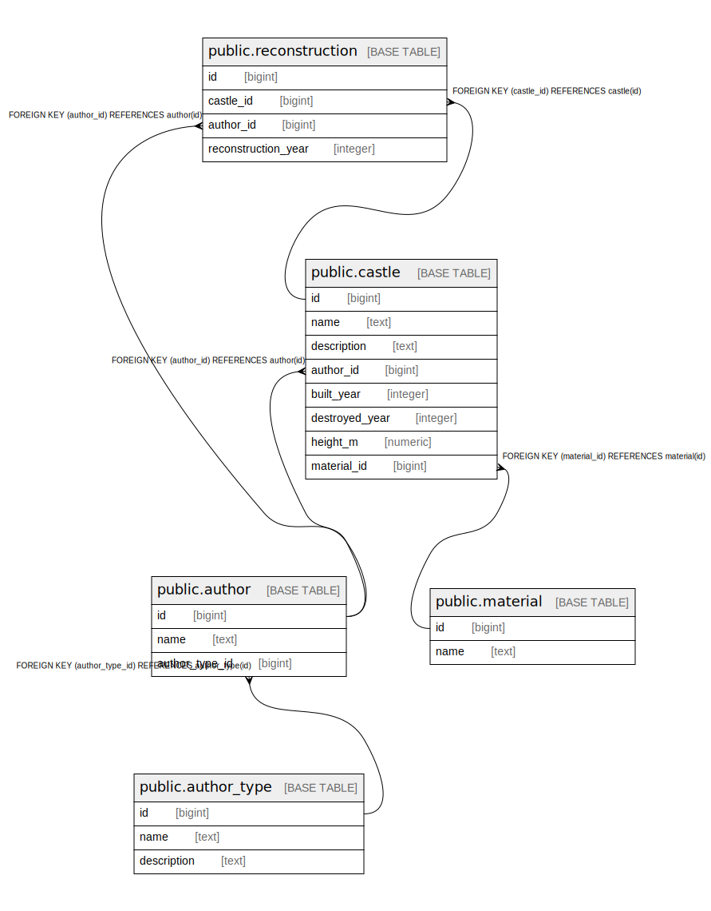

# testdb

## Tables

| Name | Columns | Comment | Type |
| ---- | ------- | ------- | ---- |
| [public.author_type](public.author_type.md) | 3 |  | BASE TABLE |
| [public.author](public.author.md) | 3 |  | BASE TABLE |
| [public.material](public.material.md) | 2 |  | BASE TABLE |
| [public.castle](public.castle.md) | 8 |  | BASE TABLE |
| [public.reconstruction](public.reconstruction.md) | 4 |  | BASE TABLE |

## Relations

---

> Generated by [tbls](https://github.com/k1LoW/tbls)
