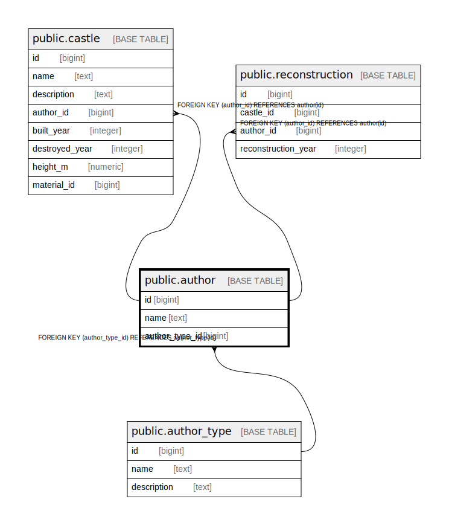

# public.author

## Description

## Columns

| Name | Type | Default | Nullable | Children | Parents | Comment |
| ---- | ---- | ------- | -------- | -------- | ------- | ------- |
| id | bigint | nextval('author_id_seq'::regclass) | false | [public.castle](public.castle.md) [public.reconstruction](public.reconstruction.md) |  |  |
| name | text |  | false |  |  |  |
| author_type_id | bigint |  | false |  | [public.author_type](public.author_type.md) |  |

## Constraints

| Name | Type | Definition |
| ---- | ---- | ---------- |
| author_author_type_id_fkey | FOREIGN KEY | FOREIGN KEY (author_type_id) REFERENCES author_type(id) |
| author_pkey | PRIMARY KEY | PRIMARY KEY (id) |

## Indexes

| Name | Definition |
| ---- | ---------- |
| author_pkey | CREATE UNIQUE INDEX author_pkey ON public.author USING btree (id) |

## Relations

---

> Generated by [tbls](https://github.com/k1LoW/tbls)
