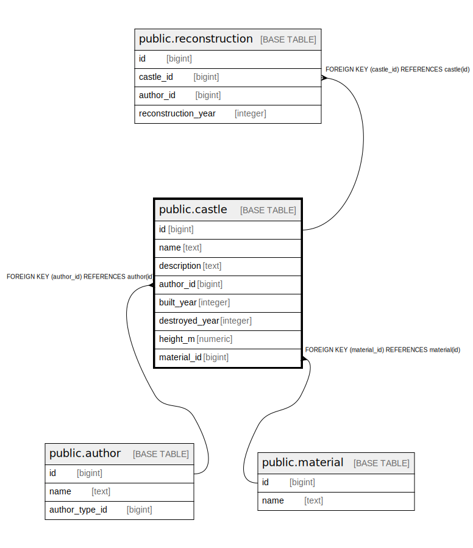

# public.castle

## Description

## Columns

| Name | Type | Default | Nullable | Children | Parents | Comment |
| ---- | ---- | ------- | -------- | -------- | ------- | ------- |
| id | bigint | nextval('castle_id_seq'::regclass) | false | [public.reconstruction](public.reconstruction.md) |  |  |
| name | text |  | false |  |  |  |
| description | text |  | true |  |  |  |
| author_id | bigint |  | true |  | [public.author](public.author.md) |  |
| built_year | integer |  | true |  |  |  |
| destroyed_year | integer |  | true |  |  |  |
| height_m | numeric |  | true |  |  |  |
| material_id | bigint |  | true |  | [public.material](public.material.md) |  |

## Constraints

| Name | Type | Definition |
| ---- | ---- | ---------- |
| castle_author_id_fkey | FOREIGN KEY | FOREIGN KEY (author_id) REFERENCES author(id) |
| castle_material_id_fkey | FOREIGN KEY | FOREIGN KEY (material_id) REFERENCES material(id) |
| castle_pkey | PRIMARY KEY | PRIMARY KEY (id) |

## Indexes

| Name | Definition |
| ---- | ---------- |
| castle_pkey | CREATE UNIQUE INDEX castle_pkey ON public.castle USING btree (id) |

## Relations

---

> Generated by [tbls](https://github.com/k1LoW/tbls)
