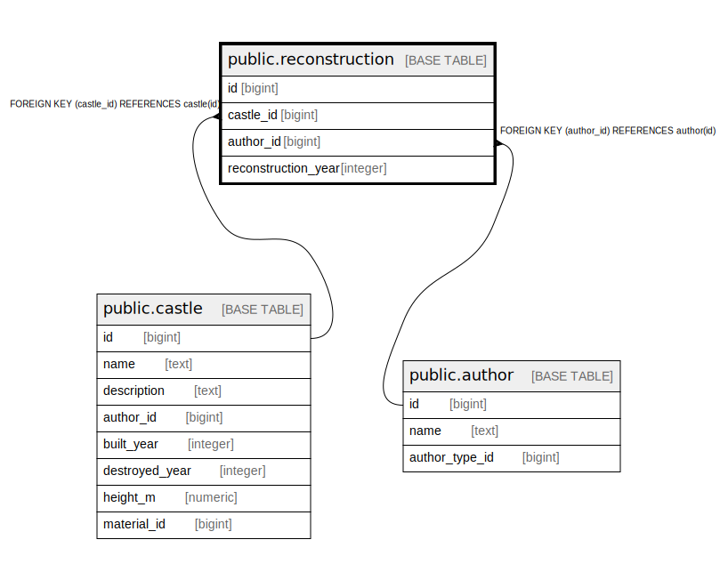

# public.reconstruction

## Description

## Columns

| Name | Type | Default | Nullable | Children | Parents | Comment |
| ---- | ---- | ------- | -------- | -------- | ------- | ------- |
| id | bigint | nextval('reconstruction_id_seq'::regclass) | false |  |  |  |
| castle_id | bigint |  | false |  | [public.castle](public.castle.md) |  |
| author_id | bigint |  | false |  | [public.author](public.author.md) |  |
| reconstruction_year | integer |  | true |  |  |  |

## Constraints

| Name | Type | Definition |
| ---- | ---- | ---------- |
| reconstruction_author_id_fkey | FOREIGN KEY | FOREIGN KEY (author_id) REFERENCES author(id) |
| reconstruction_castle_id_fkey | FOREIGN KEY | FOREIGN KEY (castle_id) REFERENCES castle(id) |
| reconstruction_pkey | PRIMARY KEY | PRIMARY KEY (id) |

## Indexes

| Name | Definition |
| ---- | ---------- |
| reconstruction_pkey | CREATE UNIQUE INDEX reconstruction_pkey ON public.reconstruction USING btree (id) |

## Relations

---

> Generated by [tbls](https://github.com/k1LoW/tbls)
