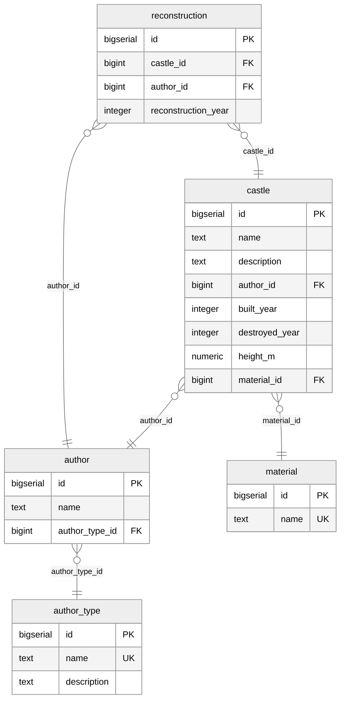

# Database Schema (Draft)

```mermaid
%%{init: {'theme': 'neutral'}}%%
erDiagram
    author }o--|| author_type : author_type_id
    castle }o--|| author : author_id
    castle }o--|| material : material_id
    reconstruction }o--|| castle : castle_id
    reconstruction }o--|| author : author_id
    author {
        bigserial id PK
        text name
        bigint author_type_id FK
    }
    author_type {
        bigserial id PK
        text name UK
        text description
    }
    castle {
        bigserial id PK
        text name
        text description
        bigint author_id FK
        integer built_year
        integer destroyed_year
        numeric height_m
        bigint material_id FK
    }
    material {
        bigserial id PK
        text name UK
    }
    reconstruction {
        bigserial id PK
        bigint castle_id FK
        bigint author_id FK
        integer reconstruction_year
    }
```

*Generated from schema-draft.yaml.*
