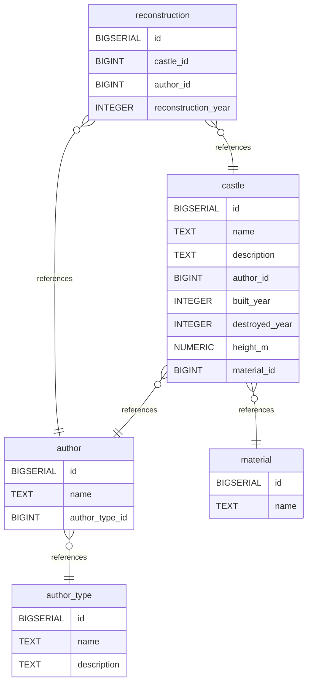

# Untitled Diagram documentation
## Summary

- [Introduction](#introduction)
- [Database Type](#database-type)
- [Table Structure](#table-structure)
	- [author_type](#author_type)
	- [author](#author)
	- [material](#material)
	- [castle](#castle)
	- [reconstruction](#reconstruction)
- [Relationships](#relationships)
- [Database Diagram](#database-diagram)

## Introduction

## Database type

- **Database system:** PostgreSQL
## Table structure

### author_type

| Name            | Type      | Settings         | References | Note |
| --------------- | --------- | ---------------- | ---------- | ---- |
| **id**          | BIGSERIAL | 🔑 PK, null      |            |      |
| **name**        | TEXT      | not null, unique |            |      |
| **description** | TEXT      | null             |            |      | 

### author

| Name               | Type      | Settings    | References                           | Note |
| ------------------ | --------- | ----------- | ------------------------------------ | ---- |
| **id**             | BIGSERIAL | 🔑 PK, null |                                      |      |
| **name**           | TEXT      | not null    |                                      |      |
| **author_type_id** | BIGINT    | not null    | fk_author_author_type_id_author_type |      | 

### material

| Name     | Type      | Settings         | References | Note |
| -------- | --------- | ---------------- | ---------- | ---- |
| **id**   | BIGSERIAL | 🔑 PK, null      |            |      |
| **name** | TEXT      | not null, unique |            |      | 

### castle

| Name               | Type      | Settings    | References                     | Note |
| ------------------ | --------- | ----------- | ------------------------------ | ---- |
| **id**             | BIGSERIAL | 🔑 PK, null |                                |      |
| **name**           | TEXT      | not null    |                                |      |
| **description**    | TEXT      | null        |                                |      |
| **author_id**      | BIGINT    | null        | fk_castle_author_id_author     |      |
| **built_year**     | INTEGER   | null        |                                |      |
| **destroyed_year** | INTEGER   | null        |                                |      |
| **height_m**       | NUMERIC   | null        |                                |      |
| **material_id**    | BIGINT    | null        | fk_castle_material_id_material |      | 

### reconstruction

| Name                    | Type      | Settings    | References                         | Note |
| ----------------------- | --------- | ----------- | ---------------------------------- | ---- |
| **id**                  | BIGSERIAL | 🔑 PK, null |                                    |      |
| **castle_id**           | BIGINT    | not null    | fk_reconstruction_castle_id_castle |      |
| **author_id**           | BIGINT    | not null    | fk_reconstruction_author_id_author |      |
| **reconstruction_year** | INTEGER   | null        |                                    |      | 

## Relationships

- **castle to author**: many_to_one
- **castle to material**: many_to_one
- **reconstruction to castle**: many_to_one
- **reconstruction to author**: many_to_one
- **author to author_type**: many_to_one

## Database Diagram

